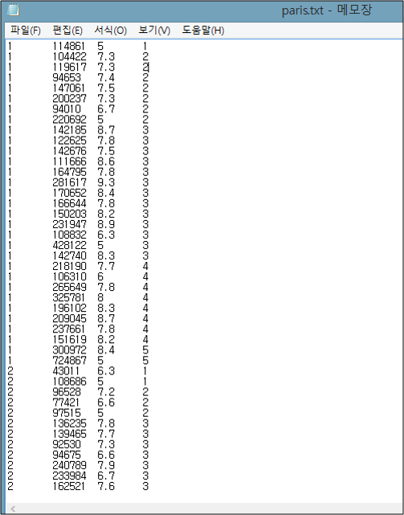
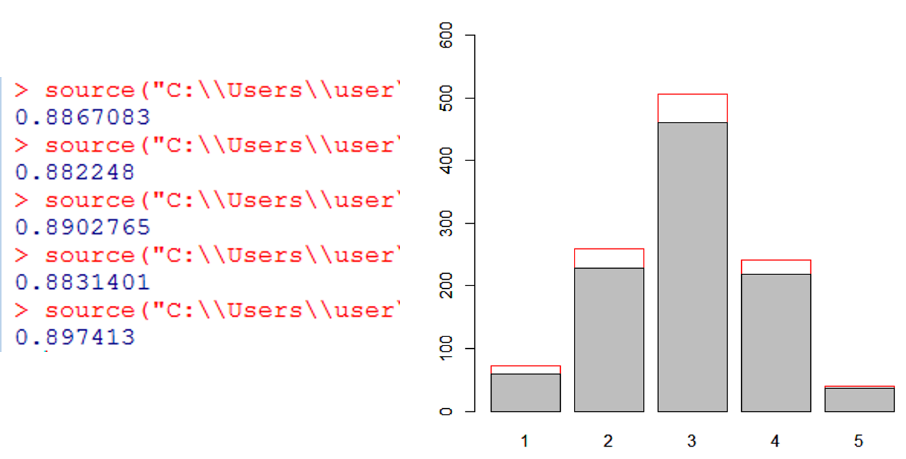
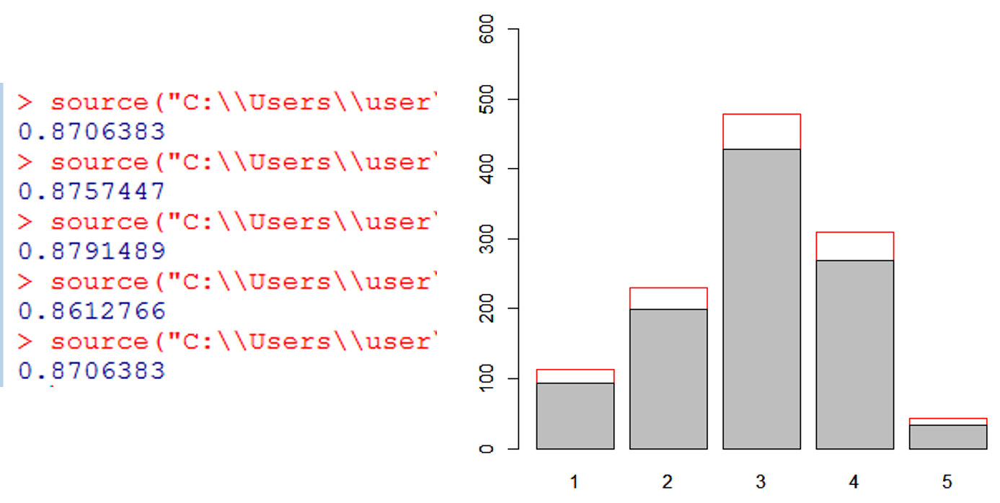
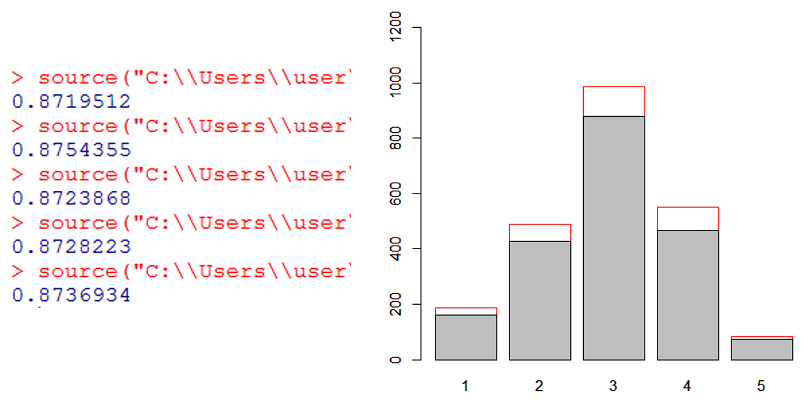

# HotelStarRating
#### Hotel Star Rating Prediction using K-Nearest Neighborhood in R  
  
### Motivation  
Have you ever seen "stars" in front of hotels? Do you know who makes a decision on hotels ratings? 
How do we trust the ratings for your convenience? It COULD be a business: More paid, more rated. 
These days many things are decided by Data Science Technology. How do you think of that our choice makes the star ratings using it? 
That was the start.
    
### Description  
This is a simple Data Analysis for predicting the star rating of hotels based on their properties provided from reservation website. 
First of all, I crawled some text data from a hotel reservation site JUST FOR STUDY. 
The _hotel_crawl.php_, which is actually not a crawller, parsed the text data to information that I need. 
That information includes customer's estimation, price, and star rating of hotels in Rome, Paris. 
Finally, the information is devided into training data and test data, 
and used by the _hotel_knn.R_ for predicting the stars based on the other features.  
  
_Note : Sorry for not giving some example data due to the ownership. I'll just show you the result_  
  
### Data
#### Paris, France  
- Number of Hotels : **1121**  
- The range of price : **9,688** to **1,082,310**  
- The range of estimation : **3.5** to **9.5**  
- The range of stars : **1** to **5**  
  
#### Rome, Italy  
- Number of Hotels : **1175**  
- The range of price : **10,409** to **649,893**  
- The range of estimation : **4.7** to **9.9**  
- The range of stars : **1** to **5**  
  
#### Arranged Data  

&nbsp;
### Results  
These results show that we may rate the stars for hotels!  
* **Result from Paris data**  

&nbsp;  
* **Result from Rome data**  

&nbsp;
* **Result from merged data**  

&nbsp;  
